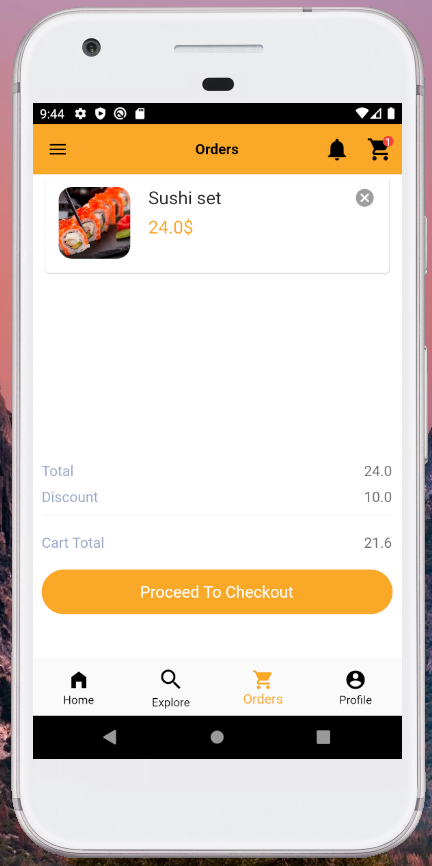
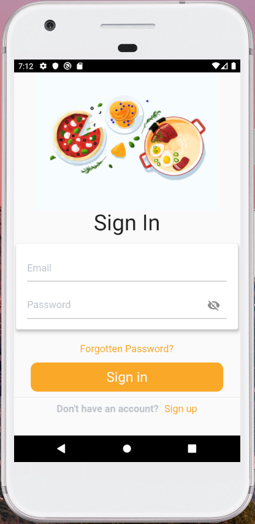

# ğŸ”🕠Food delivery app   
> This is a mobile application with modern UI written on Flutter for easy and fast food delivery. 

## 🔎 Table of contents
- [About](#-about)
- [Features](#-features)
- [Screenshots](#-screenshots)
- [License](#-license)

## 🎲 About
This particular application is written in Flutter, which is an open-source UI software development kit created by Google. It is used to develop cross platform applications for Android, iOS, Linux, Mac, Windows, Google Fuchsia and the web from a single codebase. 

## 🛠 Features
- Sign up or sign in if you already have an account
- Create personal account
- Choose from many options
- Search for favourite food
- Order anything you want
- Add items to a cart

## 📱 Screenshots

   

## 📃 License

This project has [MIT License](https://github.com/stormtrooper01/photoeditor/blob/main/LICENSE).
